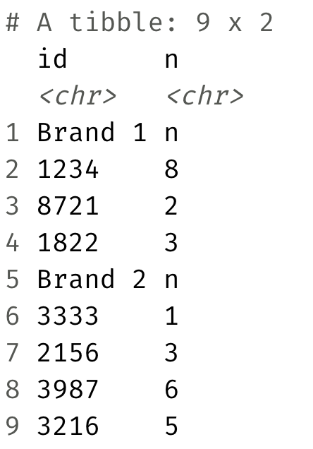
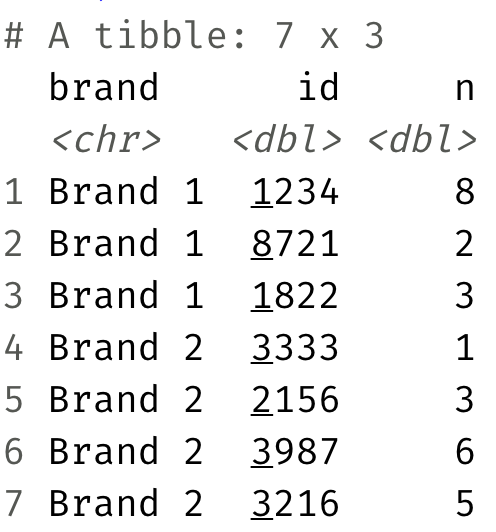

```{r load-packages, message=FALSE}
library(tidyverse)
library(readxl)
```

* Read in the Excel file called `sales.xlsx` from the `data-raw/` folder 
such that it looks like the following.

```{r echo=FALSE}

```

```{r}

```

* **Stretch goal:** Manipulate the sales data such such that it looks like the 
following.

```{r echo=FALSE}

```

```{r}

```

## References {#references}
1. Assignment Adapted from Mine Çetinkaya-Rundel's Data Science in a Box